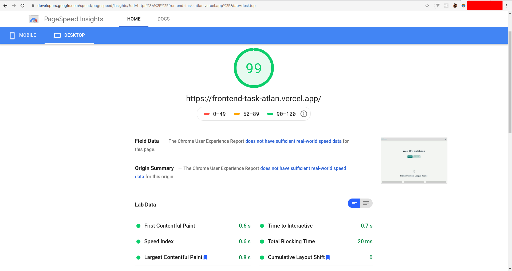

# Atlan Frontend Intern Hiring Challenge

## Steps taken to improve page load:

- Using formats like webp for smaller size of images (although, I have used very few images at the moment)

- Used TailwindCSS with PurgeCSS which helped cut down on unecessary CSS from reaching production

- Static site build which is generally faster

## Page Load @ 1.8s [(Result Here)](https://www.webpagetest.org/result/201128_DiHP_af5afa9000f4b2060d80b944dca7de24/)

## Pagespeed Insights

## Lighthouse In-Browser

## Lighthouse Online (https://web.dev/measure/)

